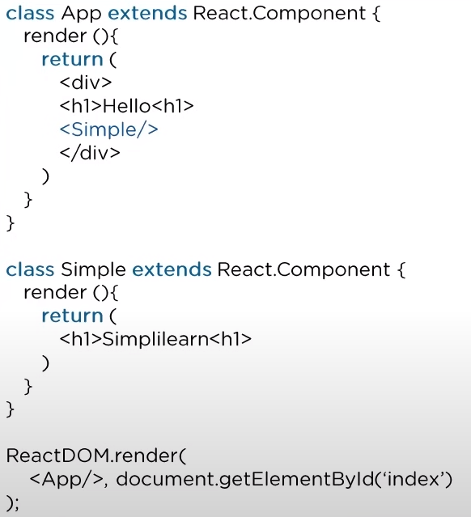

# React interview questions 2023

## What are the features of React?

- JSX is used to describe how the UI
- should look like
- A component is a piece of the UI.
- Its like a function that return HTML elements
- Has many extensions for complete architecture support
- One way data binding keeps everithing modular and fast
- Fast performance as only the changed components are updated
- The Virtual DOM is a lightweight representatiion of Real DOM

## What is JSX?

JSX, and TSX, are syntax extensions for JS and TS, They are used with React to describe what the UI shoul look like. By uning them, you can write HTML strunctures in the same file that contains JS or TS code.

```JSX
    render (<h1>Hello World</h1>)
```

## Can JSX or TSX be used directly in the web browser?

- No, the web browsers cannot read them directly, for this is used Babel.

## What is Virtual Dom

- A lightweight rep of the Real DOM, When a state of an object changes only that object from the Real Dom is updated, instead of changinging the whole page, and that makes it really faast.


## Why use React instead of Angular?
- Easy to create dynamic web apps,
- Reusable components,
- Enhanced performance of the Virtual DOM, and its more appropriate for apps- that have many dom changes. because of the Virtual DOM
- Unidirectional data flow
- Easy debugging

## What is the difference between the ES5 and ES6?

ES5:
```JSX
    var React = require('react');
    var MyComp = React.createClass({render: function(){returns (elem)}});
    module.exports = MyComp;
```


ES6:
```JSX
    import React from 'react';
    class MyComp extends React.Component { render () {return (elem)}}
    export default Component;
```

## How does one create a React app?

1. Instal Node.js, npm || NVM, npx
2. use command: "npx create-react-app my-app"

## What is an event in React?

- An event is an action that the user performes in the browser, ex: click,type, scroll.
- In React one can create an Event Listner, ex: "<button onClick={myMethod}>CTO</button>"

## What are synthetic events in React?

- A cross browser wrapper 
- A synthetic event is an object which acts as a cross-browsrer wrapper arround the browsers native element
- It combines the behaviour of different browsers native event into one API and this makes shure that the events triggered are consistent accross different browsers

## Explain how lists work in React?

- List display data in an ordered format
- Traversal of list is done using the map() function

## Why is there a need to use keys in Lists?

- A key is an unique identifier
- It is used to identify which items have changed, updated, or deleted from - the Lists
- It also helps to determine which components need to be re-rendered.
- Makeing it more performant.

## What are Forms in React?

- With Forms use is interating with the application, and enter the required information whenever needed
- Forms can contain certain elements or coponents, like input, textarea, buttons, etc.
- Forms are used for different tasks like authentication, searching, filtering, etc.

## How do you create a Form?

- Create a component ex: LoginForm
- Define state
- Handle change
- Handle submit event with success and error responses

## How dose one write comments in React

- Using JS sintax with {/* wrapped in curly braces for single and multy line comments*/}

## What are the arrow function and how it is used?

Arrow function is the short way of writing a function in React

```JSX
<MyInput onChange={   (e) => this.handleOnChange(e)   } />
```

It is not necessary to bind 'this' inside constructor when using arrow function
```JSX
<MyInput onChange={   this.handleOnChange.bind(this)   } />
```

## How is React different from React Native

|           | React         | React Native |
|-----------|---------------|--------------|
|Release    | 2013          | 2015         |
|Platform   | Web           | Mobile OS    | 
|HTML       | Y             | N            |
|CSS        | Y             | N            |
|Prereq     | JS, HTML, CSS |  RectJS

## How is React diff to Angular

|           | Angular           | React
|-----------|-------------------|----------------------|
| Author    | Google            | Facebook             |
| Arch      | Complete MVC      | View layer of MVC    |        
| DOM       | Real DOM          | Virtual Dom          |    
| Data Bind | Bi-Dir            | Uni-Dir              |
| Rendering | Client-side       | Client/Server Side   |            
| Perf      | Slower            | Faster               |


## What are the Components in React?

- hey are the building blocks, an app consist of multiple components
- It splits the UI in smaller peices of code, making it more maitainable and reusable

## What is the render() func in React?

- All component must decalire a render functions that returns the html- element
- The component must have one single root element

## What is state in React?

    State is an objects that holds some data, this data will change the output of the components

## How dose one implement state in React?

State holds the data that a component renders on the web app
```JSX
    this.state = {
        car: '',
        bike: ''
    }

    render (
        return (
            <h1>{this.state.car}</h1>
        )
    )
```

## How you change the state of a component?

Using the build-in setState() method
```
    buttonPress() {
        this.setState({
            message: 'new message'
        })
    }
```

## What are props in React?
- Props is short for properties, that allow us to pass arguments or data to components
- Props are passed to components in the way similar to that of html attributes

## How tp pass props between components?
- As html attributes as input in the template
- As function arguments in the class

## What is the diference between state and props?

|                         | State                 | Props                   |
|-------------------------|-----------------------|-------------------------|
| Use                     | info about component  | pass data to component  |
| Mutabilty               | Is Mutable            | are imutable            |
| Read-Only               | Can be changed        | are readonly            |
| Child components        | No acces from child   | can be accesed by child |
| Stateless components    | Can not have state    | Can have props          |


## What is a HOC?

- They act as containers for other components
- Keep components simple, and promotes re-usability.
- Used to contain common logic to be ised by multiple components.


## How can one embed(compose) two or more components into one?



```JSX
class App extends React.Component {
    render (){
        return {
            <div>
                <h1>Hello</h1>
                <MyComponent />
            </div>
        }
    }
}

class MyComponent extends React.Component {
    render () {
        return (
            <h2> World</h2>
        )
    }
}

ReactDOM.render(
    <App/>, document.getElementById('index')
);
```

## What are the diff between functional and class components?

```JSX

class StaefulComponent extends React.Component {
    render (
        return <div>{this.props.title}</div>
    )
}


const StatelessComponent = props => <div>{this.props.title}</div>;

```

|                         | Class                          | Function                         |
|-------------------------|--------------------------------|----------------------------------|
| State                   | They hold and manage state     | Cannot hold and manage state     |
| Simplicity              | they are more complex          | simple and easy to understand    |
| Lifecycle methods       | Can work all lifecycle methods | not work with Life Cycle methods |
| Reusability             | Can be reused                  | can not be reused                |

## Explain the lifecycle methods?

- getInitialState: is exectuted  before creation of the component
- componentDidMount: when the comp gets rendered and placed on the DOM
- shouldComponentUpdate: when a comp decides any changes to the DOM and return true/false based on conditions
- componentDidUpdate: is invoked imediatly after rendering takes place
- componentWillUnmount: is invoked imm before a comp is destroyed

## What is Redux?

Redux, is a pattern and Opensource lib to manage app state
It is the Single Sorce of Truth for the data in a modern web application

## What are the components of Redux?

- Store: It holds the state
- Action: Is the source of info for the store
- Reducer: How the app state changes as response of the actions

## What is Flux?
FLUX is the app arch pattern that Facebook is using for building web-apps

 Action -> Dispatcher -> Store -> View -> Action


## How is Redux different from FLUX?

| Redux                                                   |                Flux                               |
|---------------------------------------------------------|---------------------------------------------------|
| Redux is an open-source JS lib used to manage app State | Flux is an arch pattern, not a framwork or lib    |
| Store state is immutable                                | Store's state is mutable                          |
| It can only have a single store                         | It can have multipla store                        |
| It uses the concept of Reducer                          | It uses the concept of dispatcher                 |


## What is the React-router?

React-router is a package which is used to create routing in a React application

## Why do we need React-routing?

Used to dev Web SPA
I alows multiple views in a SPAby defining multiple routes in the React app

## How is React-routing different from conventional routing

| React routin                                            | Conventional routing                              |
|---------------------------------------------------------|---------------------------------------------------|
| Single HTML page                                        | Each view is a new html file                      |
| User navigates multiple view in the same file           | User navigates diff file for each view            |
| The page does not refresh                               | The page refreshes every time                     |
| Improoved performance                                   | Slower performance                                |

## How dose one implement React-routing?

```JSX

const routing = (
    <Router>
        <div>
            <h1>React router example</h1>
            <Route path="/" component={App} />
            <Route path="/about" component={About} />
            <Route path="/contact" component={Contact} />
        </div>
    </Router>
)

```

## How to style React components?

Inline Styling
```JSX
<h1 style="color: red">Hello</h1>
<h1 style={{color: yellow}}>Hello</h1>
```

JS object wit the representaion of the css rules

```JSX
const styles = {
    color: blue,
    text-align: center
}

<h1 style={styles}>Hello</h1>
```

## How can we use css file to style components?

Create an component css file
```CSS
h1 { color: red }
```

Import it in the component
```JSX
import "./component.css"

class Simple extends React.Component (
    render() {
        return (
            <div>
                <h1>Hello</h1>
            </div>
        )
    }
)
```

## Explain the use of CSS Modules in React!

Create a file that has the extention example.module.css
Css inside this module wil be scoped only for components that import this module